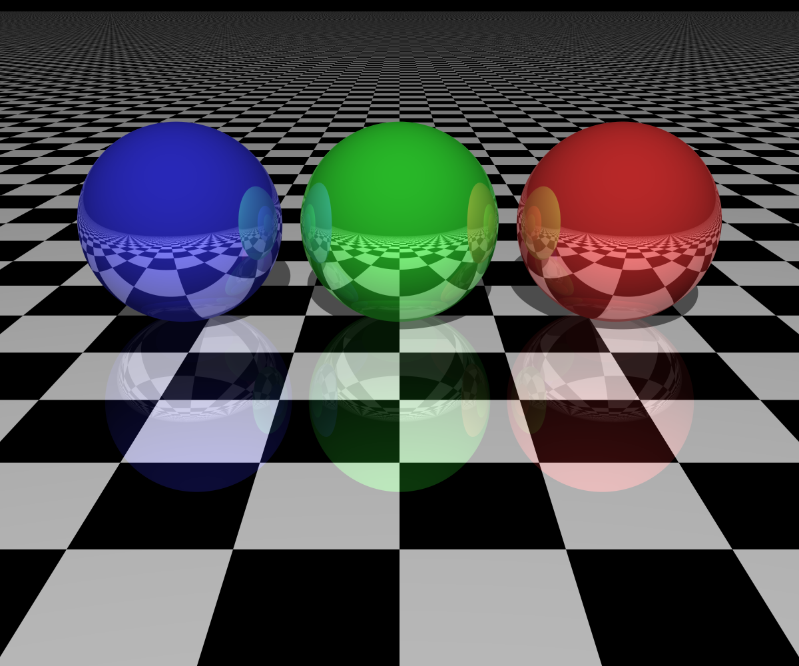
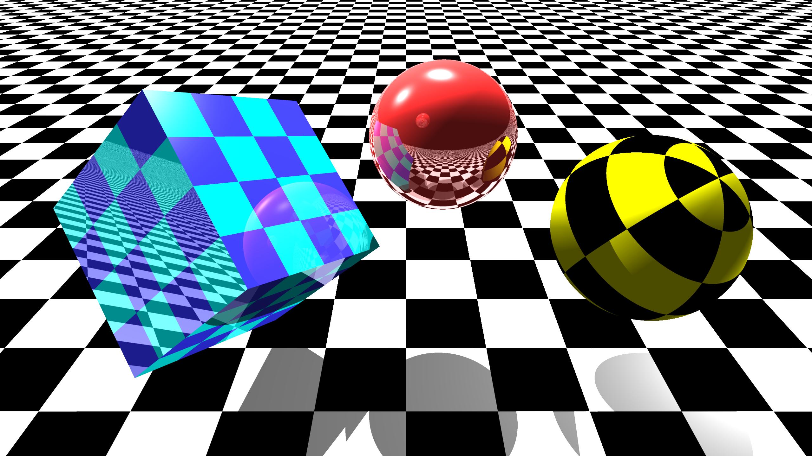
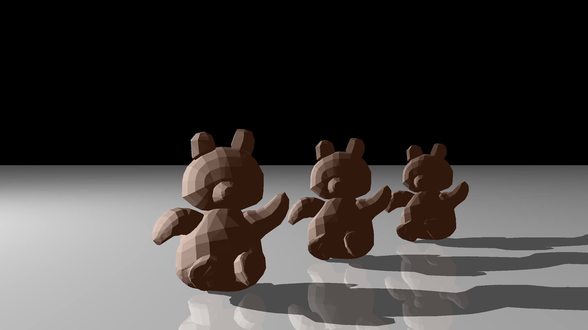
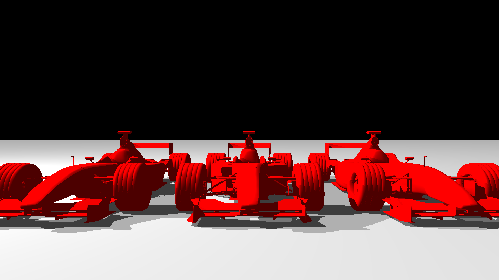
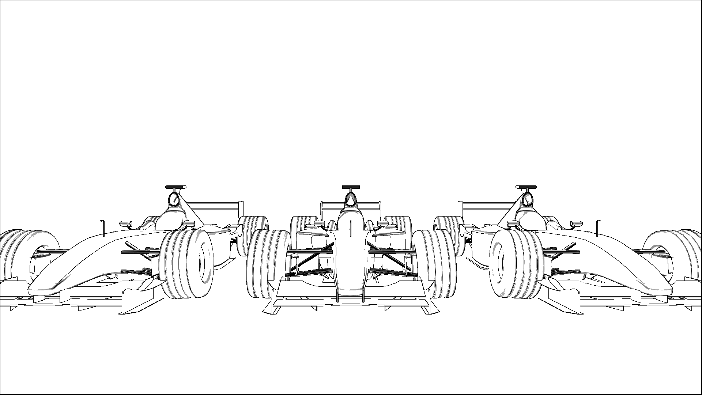
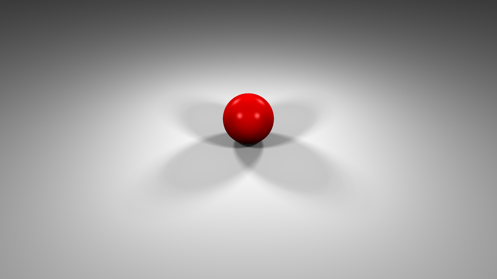
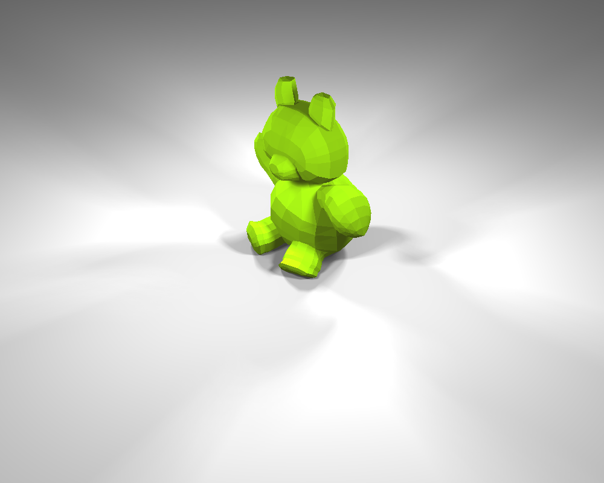
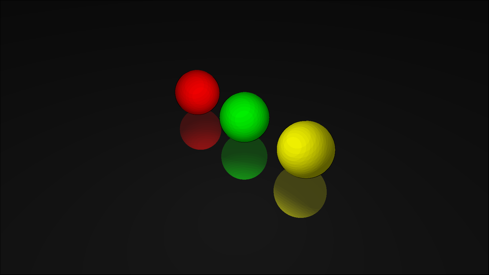

# java-raytracer
A Raytracer written in java

## Demo Images

The following images were all rendered with this project.  

### Textures & Refraction

### OBJ Loader

### Edge Detector 

### Area Light & Soft Shadows 

### Cell Shading

